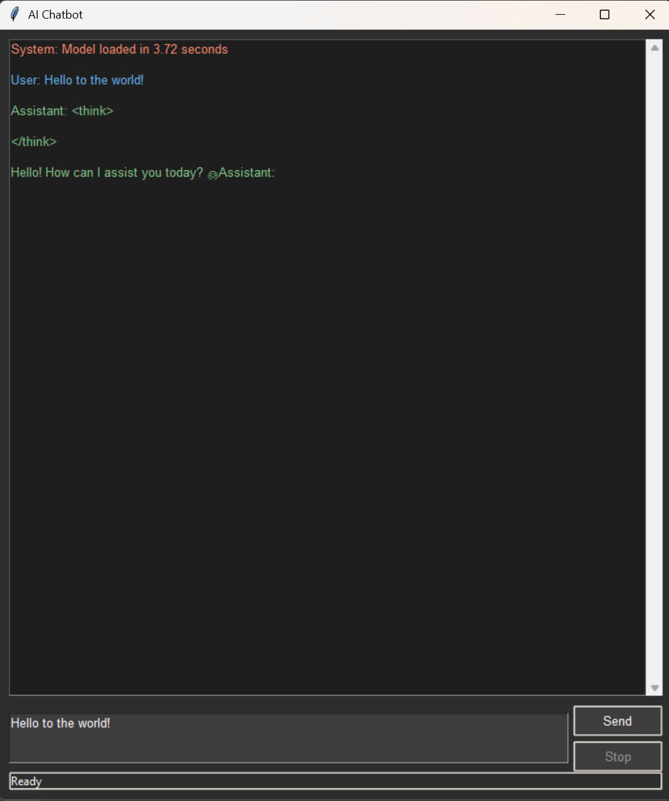
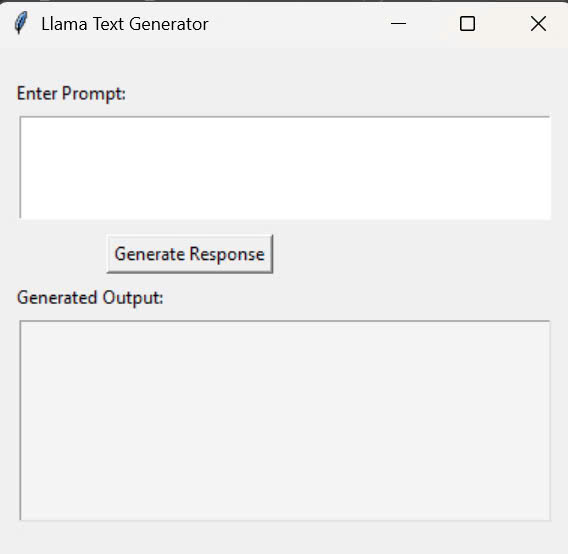
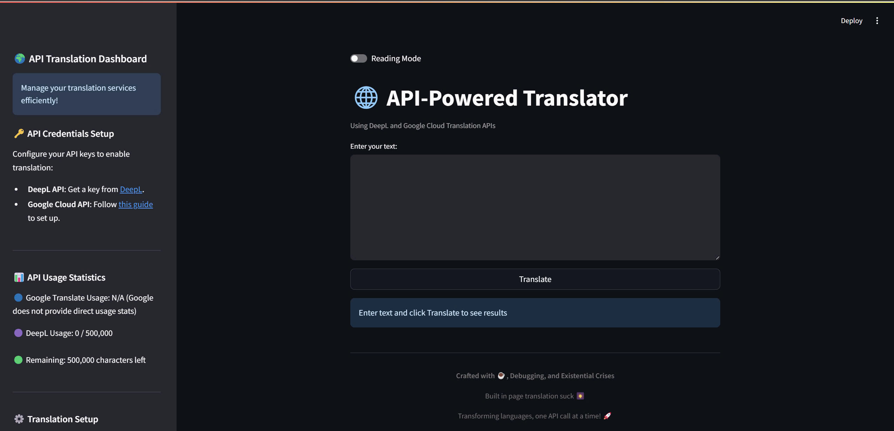
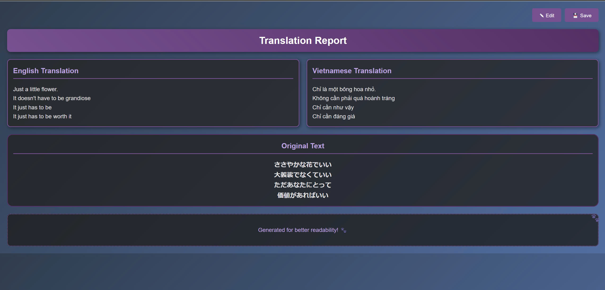

# AI Novel Translator Toolkit

A collection of four standalone Python tools for AI-powered text processing and translation.

## Table of Contents

- [Features](#features)
- [Screenshots](#screenshots)
- [Requirements](#requirements)
- [Installation](#installation)
- [Usage](#usage)
- [Configuration](#configuration)
- [Troubleshooting](#troubleshooting)
- [Contributing](#contributing)
- [License](#license)
- [Acknowledgments](#acknowledgments)

---

## Features

- **DeepSeek-R1 Chatbot** (Tkinter GUI) - Real-time AI chatbot with streaming responses.
- **Dolphin-Llama3 Chatbot** (Tkinter GUI) - A conversational AI model.
- **API Translation Web App** (Streamlit) - A web-based translator using DeepL and Google Translate.
- **M2M-100 Tester** (Experimental) - Tests the M2M-100 translation model.

---

## Screenshots

  
_Caption: Chatbot using DeepSeek model._  
  
_Caption: Chatbot using Dolphin-Llama3 model._
  
_Caption: Entering text and viewing translations side by side._  
  
_Caption: Exported HTML report with editable fields._

---

## Installation

### Prerequisites

Ensure you have Python installed, then install dependencies:

```sh
pip install llama_cpp_python torch streamlit requests google-cloud-translate python-dotenv plyer psutil transformers sentencepiece
```

---

## Usage

### 1. DeepSeek-R1 Chatbot

**Run:**

```sh
python Deepseek-abliterarted.py
```

**Requirements:**

- Download model: `DeepSeek-R1-Distill-Qwen-14B-abliterated-v2-GGUF (Q6_K)`
- Save to: `D:/AI/models/` (or modify the script’s model path)

**Features:**

- Real-time streaming responses
- Dark mode interface
- Stop generation button

---

### 2. Dolphin-Llama3 Chatbot

**Run:**

```sh
python Testing.py
```

**Requirements:**

- Download model: `dolphin-2.9-llama3-8b.Q4_K_M.gguf`
- Save to: `D:/AI/models/` (or modify the script’s model path)

---

### 3. API Translation Web App

**Run:**

```sh
streamlit run TranslatorAPI.py
```

**Setup:**

1. Create a `.env` file and add your DeepL API key:
   ```sh
   DEEPL_API_KEY=your_key_here
   ```
2. Place Google credentials in `google-credentials.json`

**Features:**

- Bilingual translation panel
- Export results as HTML/Text
- Usage statistics

---

### 4. M2M-100 Tester (Experimental)

**Run:**

```sh
python M2M-100_Script.py
```

**Note:** Uses an experimental Hugging Face model for multilingual translation.

---

## Troubleshooting

### Model Not Found?

Edit `MODEL_PATH` in scripts:

- `Deepseek-abliterarted.py` (line 28)
- `Testing.py` (line 20)

### CUDA Errors?

Try reinstalling `llama_cpp_python` with:

```sh
pip uninstall llama_cpp_python
pip install llama_cpp_python --prefer-binary
```

### API Issues?

- Verify the correct Google credentials path.
- Check DeepL API quota and key validity.

---

## Contributing

Contributions are welcome! Feel free to submit issues and pull requests.

---

## License

MIT License

---

## Acknowledgments

- **DeepSeek-R1 Model** by [mradermacher](https://github.com/mradermacher)
- **Dolphin-Llama3 Model** by [cognitivecomputations](https://github.com/cognitivecomputations)
- Built with **Streamlit** framework
